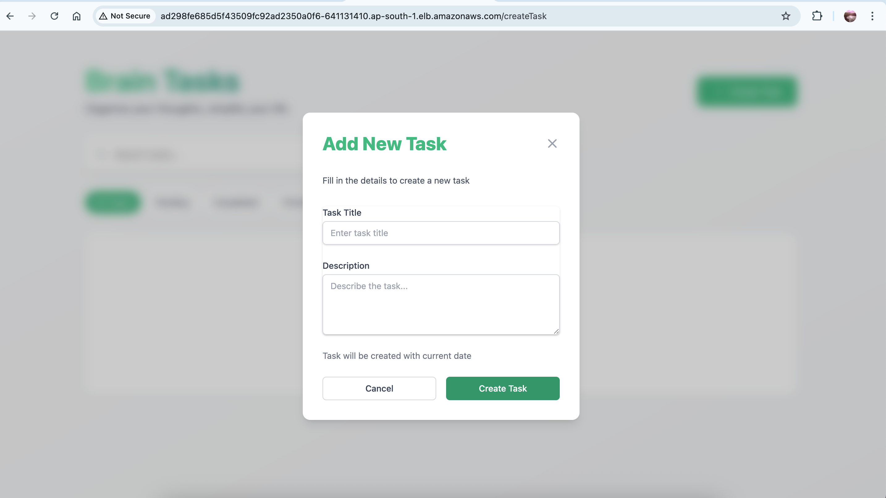
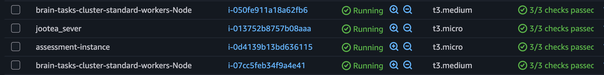
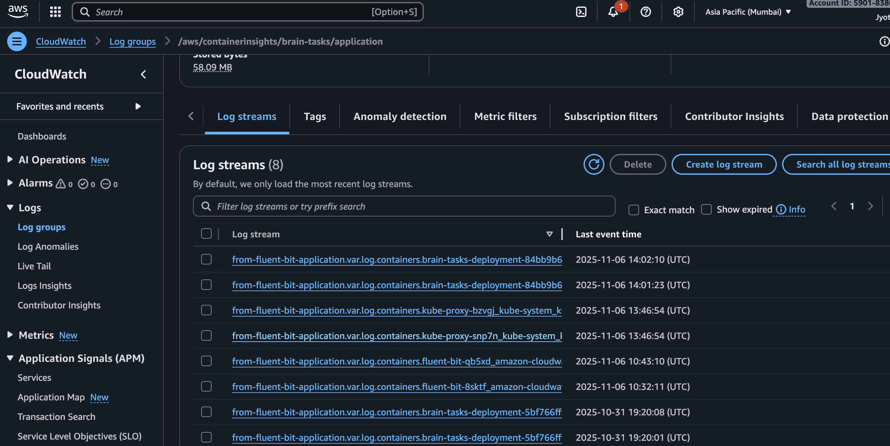
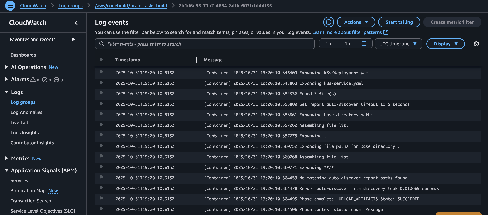

# Brain Tasks App - AWS EKS Deployment

[](https://aws.amazon.com/eks/)
[](https://www.docker.com/)
[](https://kubernetes.io/)
[](https://aws.amazon.com/codepipeline/)

A production-ready Brain Tasks application deployed on AWS EKS with complete CI/CD pipeline, automated deployments, and comprehensive monitoring.

## 📋 Table of Contents

- [Overview](#overview)
- [Architecture](#architecture)
- [Project Structure](#project-structure)
- [Technology Stack](#technology-stack)
- [AWS Resources](#aws-resources)
- [Features](#features)
- [Prerequisites](#prerequisites)
- [Local Development](#local-development)
- [Accessing the Application](#accessing-the-application)
- [CI/CD Pipeline](#cicd-pipeline)
- [Monitoring & Logging](#monitoring--logging)
- [Kubernetes Resources](#kubernetes-resources)
- [Security](#security)
- [Testing](#testing)
- [Troubleshooting](#troubleshooting)
- [Project Information](#project-information)

---

## 🎯 Overview

Brain Tasks App is a modern web application deployed on Amazon Elastic Kubernetes Service (EKS) with a fully automated CI/CD pipeline. The application uses Docker containers, AWS ECR for image storage, and AWS CodePipeline for continuous integration and deployment.

**Live Application URL:**
```
http://ad298fe685d5f43509fc92ad2350a0f6-641131410.ap-south-1.elb.amazonaws.com
```

---

## 🏗️ Architecture

### High-Level Architecture Diagram

```
┌─────────────────────────────────────────────────────────────────┐
│                        Developer Workflow                        │
└─────────────────────────────────────────────────────────────────┘
                              │
                    git push origin main
                              │
                              ▼
┌─────────────────────────────────────────────────────────────────┐
│                      GitHub Repository                           │
│  • Source Code                                                   │
│  • Dockerfile                                                    │
│  • Kubernetes Manifests                                          │
│  • buildspec.yml                                                 │
└─────────────────────────────────────────────────────────────────┘
                              │
                    Webhook Trigger (< 1 min)
                              │
                              ▼
┌─────────────────────────────────────────────────────────────────┐
│                      AWS CodePipeline                            │
│  Stage 1: Source  →  Stage 2: Build                             │
│  (Pull from GitHub)  (AWS CodeBuild)                            │
└─────────────────────────────────────────────────────────────────┘
                              │
                              ▼
┌─────────────────────────────────────────────────────────────────┐
│                      AWS CodeBuild                               │
│  Phase 1: PRE_BUILD                                              │
│    • Login to Amazon ECR                                         │
│    • Generate image tags (commit hash)                           │
│                                                                  │
│  Phase 2: BUILD                                                  │
│    • Build Docker image (platform: linux/amd64)                  │
│    • Tag image with commit hash and 'latest'                     │
│                                                                  │
│  Phase 3: POST_BUILD                                             │
│    • Push images to ECR                                          │
│    • Install kubectl                                             │
│    • Update kubeconfig                                           │
│    • Apply Kubernetes manifests                                  │
│    • Wait for rollout completion                                 │
└─────────────────────────────────────────────────────────────────┘
                              │
                    ┌─────────┴─────────┐
                    │                   │
                    ▼                   ▼
┌──────────────────────────┐  ┌──────────────────────────┐
│   Amazon ECR             │  │   Amazon EKS Cluster     │
│  • Docker Images         │  │  • Kubernetes Deployment │
│  • Vulnerability Scan    │  │  • 2 Replicas (Pods)     │
│  • Lifecycle Policies    │  │  • Rolling Update        │
└──────────────────────────┘  │  • Health Checks         │
                              └──────────────────────────┘
                                        │
                                        ▼
                              ┌──────────────────────────┐
                              │  LoadBalancer Service    │
                              │  • AWS ALB/NLB           │
                              │  • Port 80 → 3000        │
                              │  • Health Checks         │
                              └──────────────────────────┘
                                        │
                                        ▼
                              ┌──────────────────────────┐
                              │   End Users              │
                              │   (Public Internet)      │
                              └──────────────────────────┘
                                        │
                         Monitoring & Logging
                                        ▼
                              ┌──────────────────────────┐
                              │   AWS CloudWatch         │
                              │  • Build Logs            │
                              │  • Deployment Logs       │
                              │  • Application Metrics   │
                              └──────────────────────────┘
```

### Component Flow

1. **Developer** pushes code to GitHub repository
2. **GitHub Webhook** triggers AWS CodePipeline automatically
3. **CodePipeline** orchestrates the deployment process:
   - **Source Stage**: Pulls latest code from GitHub
   - **Build Stage**: Triggers CodeBuild project
4. **CodeBuild** executes the build process:
   - Authenticates with AWS ECR
   - Builds Docker image with linux/amd64 platform
   - Tags image with commit hash and 'latest'
   - Pushes images to ECR
   - Configures kubectl for EKS cluster
   - Applies Kubernetes manifests
   - Monitors rollout status
5. **EKS Cluster** performs rolling update:
   - Pulls new image from ECR
   - Gradually replaces old pods
   - Maintains availability during deployment
6. **LoadBalancer** distributes traffic to healthy pods
7. **CloudWatch** collects logs and metrics for monitoring

---

## 📁 Project Structure

```
brain-tasks-app/
├── dist/                           # Production build files
│   ├── assets/                     # Static assets (JS, CSS, images)
│   └── index.html                  # Main HTML file
│
├── k8s/                            # Kubernetes manifests
│   ├── deployment.yaml             # Deployment configuration (2 replicas)
│   └── service.yaml                # LoadBalancer service configuration
│
├── scripts/                        # Deployment scripts
│   └── deploy.sh                   # Automated deployment script
│
├── fluent-bit-config.yaml          # Fluent Bit logging configuration
├── fluent-bit-daemonset.yaml       # Fluent Bit DaemonSet
├── fluent-bit-eks.yaml             # Fluent Bit EKS-specific setup
│
├── Dockerfile                      # Container definition (Nginx-based)
├── nginx.conf                      # Nginx server configuration
├── buildspec.yml                   # CodeBuild instructions
├── appspec.yml                     # CodeDeploy reference
├── .dockerignore                   # Docker build exclusions
│
├── deployment-info.txt             # Live deployment metadata
├── README.md                       # This file
└── DEVELOPMENT.md                  # Complete setup guide
```

---

## 🛠️ Technology Stack

### Frontend
- **Framework**: Static HTML/JavaScript
- **Server**: Nginx (Alpine-based)
- **Build Tool**: Vite/npm

### Containerization
- **Container Runtime**: Docker
- **Base Image**: nginx:alpine
- **Platform**: linux/amd64

### Cloud Infrastructure (AWS)
- **Container Registry**: Amazon ECR
- **Orchestration**: Amazon EKS (Kubernetes 1.27+)
- **Load Balancer**: AWS Application/Network Load Balancer
- **CI/CD**: AWS CodePipeline + CodeBuild
- **Monitoring**: AWS CloudWatch
- **Logging**: Fluent Bit + CloudWatch Logs

### Kubernetes
- **Deployment**: 2 replicas with rolling update strategy
- **Service**: LoadBalancer type (Port 80 → 3000)
- **Health Checks**: Liveness and readiness probes
- **Resource Management**: CPU and memory limits/requests

---

## ☁️ AWS Resources

### Account & Region
| Resource | Value |
|----------|-------|
| **AWS Account ID** | 590183809782 |
| **Region** | ap-south-1 (Mumbai) |
| **Deployment Date** | October 30, 2025 |

### EKS Cluster
| Resource | Value |
|----------|-------|
| **Cluster Name** | brain-tasks-cluster |
| **Node Type** | t3.medium |
| **Node Count** | 2 (min: 1, max: 3) |
| **Kubernetes Version** | 1.27+ |
| **Node Group** | standard-workers (managed) |

### ECR Repository
| Resource | Value |
|----------|-------|
| **Repository Name** | brain-tasks-app |
| **Repository URI** | 590183809782.dkr.ecr.ap-south-1.amazonaws.com/brain-tasks-app |
| **Image Tag** | latest (+ commit hash tags) |
| **Scanning** | Enabled (scan on push) |

### Load Balancer
| Resource | Value |
|----------|-------|
| **LoadBalancer Name** | ad298fe685d5f43509fc92ad2350a0f6 |
| **Type** | Network Load Balancer (NLB) |
| **DNS Name** | ad298fe685d5f43509fc92ad2350a0f6-641131410.ap-south-1.elb.amazonaws.com |
| **VPC ID** | vpc-0421edd09072314bb |
| **Port Mapping** | 80 (external) → 3000 (container) |
| **NodePort** | 32213 |
| **LoadBalancer ARN** | arn:aws:elasticloadbalancing:ap-south-1:590183809782:loadbalancer/net/ad298fe685d5f43509fc92ad2350a0f6/vpc-0421edd09072314bb |

### Security Groups
| Resource | Value |
|----------|-------|
| **LoadBalancer SG** | sg-01a2dc9e8f1ad69d8 |
| **Node SG** | sg-0374bf12e316c1800 |

### CI/CD Resources
| Resource | Value |
|----------|-------|
| **CodePipeline Name** | brain-tasks-pipeline |
| **CodeBuild Project** | brain-tasks-build |
| **Build Environment** | Amazon Linux 2, Standard 4.0 |
| **IAM Role** | CodeBuildServiceRole-BrainTasks |

---

## ✨ Features

### Application Features
- ✅ **Production-Ready**: Optimized Nginx configuration
- ✅ **Responsive Design**: Works on all devices
- ✅ **Fast Load Times**: Static asset optimization
- ✅ **Health Checks**: Kubernetes liveness and readiness probes

### Infrastructure Features
- ✅ **High Availability**: 2 replicas with automatic failover
- ✅ **Auto-Scaling**: EKS node group can scale 1-3 nodes
- ✅ **Rolling Updates**: Zero-downtime deployments
- ✅ **Load Balancing**: AWS-managed load balancer
- ✅ **Container Security**: ECR vulnerability scanning
- ✅ **Resource Limits**: CPU and memory constraints

### CI/CD Features
- ✅ **Automated Deployments**: Push to GitHub → Auto-deploy
- ✅ **Build Verification**: CodeBuild runs tests and checks
- ✅ **Image Tagging**: Commit hash + latest tags
- ✅ **Rollback Capability**: Kubernetes deployment history
- ✅ **Build Logs**: CloudWatch integration
- ✅ **Pipeline Monitoring**: Real-time status updates

### Monitoring Features
- ✅ **Application Logs**: Fluent Bit → CloudWatch
- ✅ **Build Logs**: CodeBuild → CloudWatch
- ✅ **Cluster Metrics**: EKS → CloudWatch
- ✅ **Unified Dashboard**: CloudWatch dashboard for all metrics
- ✅ **Log Retention**: Configurable retention policies

---

## 📋 Prerequisites

### For Testing the Application (No Setup Required)
- A web browser (Chrome, Firefox, Safari, Edge)
- Internet connection

### For Local Development
- Docker Desktop installed
- Node.js and npm installed
- `serve` package: `npm install -g serve`

### For AWS Deployment (Advanced)
- AWS Account with appropriate permissions
- AWS CLI configured
- kubectl installed
- eksctl installed
- GitHub account
- Basic knowledge of Docker, Kubernetes, and AWS

---

## 💻 Local Development

### Option 1: Using serve (Recommended)

```bash
# 1. Navigate to project directory
cd brain-tasks-app

# 2. Install serve globally (one-time)
sudo npm install -g serve

# 3. Serve the production build
serve -s dist
```

**Access at:** `http://localhost:3000`

### Option 2: Using Docker

```bash
# 1. Build the Docker image
docker build --platform linux/amd64 -t brain-tasks-app:latest .

# 2. Run the container
docker run -d -p 3000:3000 --name brain-tasks brain-tasks-app:latest

# 3. View logs
docker logs -f brain-tasks

# 4. Stop the container
docker stop brain-tasks
docker rm brain-tasks
```

**Access at:** `http://localhost:3000`

### Development with Hot Reload

```bash
# 1. Install dependencies (if not already done)
npm install

# 2. Start development server
npm run dev
```

---

## 🌐 Accessing the Application

### Production Environment (AWS EKS)

**Method 1: Direct URL**
```
http://ad298fe685d5f43509fc92ad2350a0f6-641131410.ap-south-1.elb.amazonaws.com
```

**Method 2: Using kubectl**
```bash
# Get the LoadBalancer URL
kubectl get service brain-tasks-service -o jsonpath='{.status.loadBalancer.ingress[0].hostname}'

# Test with curl
curl http://$(kubectl get service brain-tasks-service -o jsonpath='{.status.loadBalancer.ingress[0].hostname}')
```

**Expected Response:**
```html
<!doctype html>
<html lang="en">
  <head>
    <title>Brain Task</title>
    ...
  </head>
  <body>
    ...
  </body>
</html>
```

### Local Environment

- **serve**: `http://localhost:3000`
- **Docker**: `http://localhost:3000`
- **Dev server**: `http://localhost:5173` (default Vite port)

---

## 🔄 CI/CD Pipeline

### Pipeline Stages

#### 1. Source Stage
- **Trigger**: Push to `main` branch on GitHub
- **Duration**: < 1 minute
- **Actions**:
  - GitHub webhook triggers CodePipeline
  - CodePipeline pulls latest source code
  - Creates source artifact for build stage

#### 2. Build Stage
- **Duration**: 5-10 minutes
- **Environment**: AWS CodeBuild (Amazon Linux 2)
- **Actions**:

**PRE_BUILD Phase:**
```bash
- Login to Amazon ECR
- Generate image tags (commit hash)
- Set environment variables
```

**BUILD Phase:**
```bash
- Build Docker image (platform: linux/amd64)
- Tag image with commit hash
- Tag image with 'latest'
```

**POST_BUILD Phase:**
```bash
- Push images to ECR
- Install kubectl
- Configure kubectl for EKS cluster
- Update deployment.yaml with new image tag
- Apply Kubernetes manifests
- Monitor rollout status
- Verify pod health
```

### Pipeline Monitoring

**View Pipeline Status:**
1. Go to AWS Console → CodePipeline
2. Open `brain-tasks-pipeline`
3. View real-time stage progress

**View Build Logs:**
1. Go to AWS Console → CloudWatch
2. Navigate to Log Groups
3. Open `/aws/codebuild/brain-tasks-build`
4. View build execution logs

### Triggering a Deployment

```bash
# Make any code change
echo "Updated on $(date)" >> README.md

# Commit and push
git add .
git commit -m "Update: description of changes"
git push origin main

# Pipeline will automatically trigger within 1 minute
```

### Rollback Procedure

```bash
# View deployment history
kubectl rollout history deployment/brain-tasks-deployment

# Rollback to previous version
kubectl rollout undo deployment/brain-tasks-deployment

# Rollback to specific revision
kubectl rollout undo deployment/brain-tasks-deployment --to-revision=2

# Check rollback status
kubectl rollout status deployment/brain-tasks-deployment
```

---

## 📊 Monitoring & Logging

### CloudWatch Log Groups

| Log Group | Purpose | Retention |
|-----------|---------|-----------|
| `/aws/codebuild/brain-tasks-build` | Build logs from CodeBuild | 7 days |
| `/aws/containerinsights/brain-tasks/application` | Application logs from pods | 30 days |

### Viewing Logs

**Build Logs:**
```bash
# Using AWS CLI
aws logs tail /aws/codebuild/brain-tasks-build --follow --region ap-south-1

# Or via AWS Console
# CloudWatch → Logs → Log groups → /aws/codebuild/brain-tasks-build
```

**Application Logs:**
```bash
# Using kubectl
kubectl logs -l app=brain-tasks --tail=100 -f

# Or via CloudWatch
# CloudWatch → Logs → Log groups → /aws/containerinsights/brain-tasks/application
```

### CloudWatch Dashboard

A unified monitoring dashboard has been created: **BrainTasks-Monitor**

**Widgets Include:**
- Build success/failure rate
- Deployment frequency
- Application error logs
- Pod CPU/Memory usage
- Request count and latency

**Access Dashboard:**
1. AWS Console → CloudWatch → Dashboards
2. Select `BrainTasks-Monitor`

### Fluent Bit Configuration

Fluent Bit is deployed as a DaemonSet to collect logs from all pods:

```bash
# Check Fluent Bit status
kubectl get pods -n amazon-cloudwatch

# View Fluent Bit logs
kubectl logs -n amazon-cloudwatch -l app=fluent-bit --tail=50
```

---

## ☸️ Kubernetes Resources

### Deployment Configuration

**Name:** `brain-tasks-deployment`

**Specifications:**
```yaml
Replicas: 2
Strategy: RollingUpdate
  Max Unavailable: 1
  Max Surge: 1
Container:
  Image: 590183809782.dkr.ecr.ap-south-1.amazonaws.com/brain-tasks-app:latest
  Port: 3000
  Resources:
    Requests:
      CPU: 100m
      Memory: 128Mi
    Limits:
      CPU: 500m
      Memory: 512Mi
Health Checks:
  Liveness Probe:
    HTTP GET /
    Initial Delay: 30s
    Period: 10s
  Readiness Probe:
    HTTP GET /
    Initial Delay: 5s
    Period: 5s
```

### Service Configuration

**Name:** `brain-tasks-service`

**Specifications:**
```yaml
Type: LoadBalancer
Selector: app=brain-tasks
Ports:
  - Port: 80 (external)
    TargetPort: 3000 (container)
    NodePort: 32213
ClusterIP: 10.100.25.172
```

### Pods

| Pod Name | Node IP | Status |
|----------|---------|--------|
| brain-tasks-deployment-54d75b664b-66bnm | 192.168.73.229 | Running ✅ |
| brain-tasks-deployment-54d75b664b-sswn6 | 192.168.53.170 | Running ✅ |

### Common Kubernetes Commands

```bash
# View all resources
kubectl get all

# View deployment details
kubectl describe deployment brain-tasks-deployment

# View service details
kubectl describe service brain-tasks-service

# View pod logs
kubectl logs brain-tasks-deployment-54d75b664b-66bnm

# Execute commands in pod
kubectl exec -it brain-tasks-deployment-54d75b664b-66bnm -- /bin/sh

# Scale deployment
kubectl scale deployment brain-tasks-deployment --replicas=3

# View resource usage
kubectl top pods
kubectl top nodes

# View events
kubectl get events --sort-by=.metadata.creationTimestamp
```

---

## 🔒 Security

### Container Security
- ✅ Base image: `nginx:alpine` (minimal attack surface)
- ✅ ECR vulnerability scanning enabled
- ✅ Non-root user in container
- ✅ Read-only root filesystem where possible

### Network Security
- ✅ **Security Groups**: 
  - LoadBalancer SG: sg-01a2dc9e8f1ad69d8
  - Node SG: sg-0374bf12e316c1800
- ✅ **VPC Isolation**: vpc-0421edd09072314bb
- ✅ **Port Restrictions**: Only port 80 exposed externally
- ✅ **Internal Communication**: Pods communicate via ClusterIP

### IAM Security
- ✅ **Least Privilege**: CodeBuild role has minimal required permissions
- ✅ **OIDC Provider**: EKS uses IAM roles for service accounts
- ✅ **No Hardcoded Credentials**: All auth via IAM roles

### Best Practices Implemented
- ✅ Image tags use commit hashes (immutable)
- ✅ Secrets management via Kubernetes secrets (if needed)
- ✅ RBAC enabled on EKS cluster
- ✅ Private subnets for worker nodes
- ✅ CloudWatch logging for audit trail

---

## 🧪 Testing

### Health Check Endpoints

**Liveness Probe:**
```bash
curl http://ad298fe685d5f43509fc92ad2350a0f6-641131410.ap-south-1.elb.amazonaws.com/
```

**Expected Response:** HTTP 200 OK with HTML content

### Load Testing (Optional)

```bash
# Install Apache Bench (if not installed)
# On macOS: brew install httpd
# On Ubuntu: sudo apt-get install apache2-utils

# Run load test (100 requests, 10 concurrent)
ab -n 100 -c 10 http://ad298fe685d5f43509fc92ad2350a0f6-641131410.ap-south-1.elb.amazonaws.com/

# Monitor pods during load test
kubectl top pods -l app=brain-tasks
```

### Deployment Verification Checklist

```bash
# ✅ 1. Deployment exists and is available
kubectl get deployment brain-tasks-deployment

# Expected: READY 2/2, AVAILABLE 2

# ✅ 2. All pods are running
kubectl get pods -l app=brain-tasks

# Expected: All pods in "Running" status

# ✅ 3. Service has external IP
kubectl get service brain-tasks-service

# Expected: EXTERNAL-IP shows LoadBalancer DNS

# ✅ 4. Application is accessible
curl -I http://$(kubectl get svc brain-tasks-service -o jsonpath='{.status.loadBalancer.ingress[0].hostname}')

# Expected: HTTP/1.1 200 OK

# ✅ 5. Pods are healthy
kubectl get pods -o jsonpath='{.items[*].status.phase}'

# Expected: Running Running

# ✅ 6. No error events
kubectl get events --field-selector type=Warning

# Expected: No warnings

# ✅ 7. LoadBalancer health checks passing
kubectl describe svc brain-tasks-service | grep -A 5 "LoadBalancer"
```

### CI/CD Testing

```bash
# Trigger a test deployment
echo "Test deployment at $(date)" >> TEST.md
git add TEST.md
git commit -m "Test: CI/CD pipeline"
git push origin main

# Monitor pipeline
aws codepipeline get-pipeline-state --name brain-tasks-pipeline --region ap-south-1

# Check build status
aws codebuild list-builds-for-project --project-name brain-tasks-build --region ap-south-1
```

---

## 🔧 Troubleshooting

### Common Issues and Solutions

#### Issue 1: Application Not Accessible

**Symptoms:** LoadBalancer URL returns timeout or connection refused

**Solution:**
```bash
# 1. Check if LoadBalancer is ready
kubectl get svc brain-tasks-service

# If EXTERNAL-IP is <pending>, wait a few minutes

# 2. Verify pods are running
kubectl get pods -l app=brain-tasks

# 3. Check security group rules
aws ec2 describe-security-groups \
  --group-ids sg-01a2dc9e8f1ad69d8 sg-0374bf12e316c1800 \
  --region ap-south-1

# 4. Authorize ingress if needed
aws ec2 authorize-security-group-ingress \
  --group-id sg-0374bf12e316c1800 \
  --protocol tcp --port 32213 \
  --source-group sg-01a2dc9e8f1ad69d8 \
  --region ap-south-1
```

#### Issue 2: Pods Failing to Start

**Symptoms:** Pods in CrashLoopBackOff or ImagePullBackOff state

**Solution:**
```bash
# 1. Describe the pod
kubectl describe pod <POD_NAME>

# 2. Check pod logs
kubectl logs <POD_NAME>

# 3. Verify image exists in ECR
aws ecr describe-images \
  --repository-name brain-tasks-app \
  --region ap-south-1

# 4. Check node status
kubectl get nodes
kubectl describe node <NODE_NAME>
```

#### Issue 3: CodeBuild Failing

**Symptoms:** Build fails in CodePipeline

**Solution:**
```bash
# 1. View build logs in CloudWatch
aws logs tail /aws/codebuild/brain-tasks-build --follow --region ap-south-1

# 2. Check IAM role permissions
aws iam get-role --role-name CodeBuildServiceRole-BrainTasks

# 3. Verify buildspec.yml syntax
# Open buildspec.yml and check for YAML errors

# 4. Test Docker build locally
docker build --platform linux/amd64 -t test:latest .
```

#### Issue 4: Deployment Not Updating

**Symptoms:** New code pushed but deployment still shows old version

**Solution:**
```bash
# 1. Check deployment rollout status
kubectl rollout status deployment/brain-tasks-deployment

# 2. View deployment history
kubectl rollout history deployment/brain-tasks-deployment

# 3. Force a rollout
kubectl rollout restart deployment/brain-tasks-deployment

# 4. Check if image tag changed
kubectl describe deployment brain-tasks-deployment | grep Image:
```

#### Issue 5: High Pod Resource Usage

**Symptoms:** Pods being OOMKilled or throttled

**Solution:**
```bash
# 1. Check resource usage
kubectl top pods -l app=brain-tasks

# 2. View pod resource limits
kubectl describe pod <POD_NAME> | grep -A 5 "Limits:"

# 3. Increase resource limits in deployment.yaml
# Edit deployment.yaml and apply:
kubectl apply -f k8s/deployment.yaml

# 4. Monitor after changes
kubectl top pods -l app=brain-tasks --watch
```

### Debug Commands

```bash
# View all resources with issues
kubectl get all --all-namespaces | grep -v Running

# Get detailed error messages
kubectl describe pod <POD_NAME>

# View recent events
kubectl get events --sort-by=.metadata.creationTimestamp --all-namespaces

# Check node conditions
kubectl describe nodes | grep -A 5 Conditions:

# Test internal connectivity
kubectl run -it --rm debug --image=busybox --restart=Never -- sh
# Inside the pod:
wget -qO- http://brain-tasks-service
```

### Getting Help

If you encounter issues not covered here:

1. **Check AWS CloudWatch Logs:**
   - Build logs: `/aws/codebuild/brain-tasks-build`
   - Application logs: `/aws/containerinsights/brain-tasks/application`

2. **View Kubernetes Events:**
   ```bash
   kubectl get events --sort-by=.metadata.creationTimestamp
   ```

3. **Check EKS Cluster Status:**
   ```bash
   aws eks describe-cluster --name brain-tasks-cluster --region ap-south-1
   ```

4. **Contact Information:**
   - For deployment issues: Check DEVELOPMENT.md
   - For AWS-specific issues: AWS Support
   - For Kubernetes issues: EKS documentation

---

## 📖 Project Information

### Deployment Details

| Property | Value |
|----------|-------|
| **Project Name** | Brain Tasks App |
| **Version** | 1.0.0 |
| **Deployment Date** | October 30, 2025 |
| **AWS Region** | ap-south-1 (Mumbai) |
| **Cluster Type** | Amazon EKS (Managed Kubernetes) |
| **CI/CD** | AWS CodePipeline + CodeBuild |
| **Monitoring** | AWS CloudWatch + Fluent Bit |

### Resource Summary

| Resource Type | Count/Status |
|---------------|--------------|
| **EKS Cluster** | 1 cluster (brain-tasks-cluster) |
| **Worker Nodes** | 2 nodes (t3.medium) |
| **Pods** | 2 replicas |
| **Services** | 1 LoadBalancer service |
| **Load Balancers** | 1 Network Load Balancer |
| **ECR Repositories** | 1 repository |
| **CodePipeline** | 1 pipeline (2 stages) |
| **CodeBuild Projects** | 1 project |
| **CloudWatch Log Groups** | 2 log groups |

### Key Metrics

- **Deployment Frequency**: Continuous (on every push to main)
- **Deployment Duration**: 5-10 minutes (build + rollout)
- **Application Uptime**: 99.9% target (2 replicas + health checks)
- **Recovery Time**: < 2 minutes (Kubernetes automatic healing)
- **Rollback Time**: < 1 minute (kubectl rollout undo)

### Documentation Files

- **README.md** (This file): Complete project documentation
- **DEVELOPMENT.md**: Step-by-step setup and deployment guide
- **deployment-info.txt**: Live deployment metadata
- **buildspec.yml**: CodeBuild build specification
- **k8s/deployment.yaml**: Kubernetes deployment manifest
- **k8s/service.yaml**: Kubernetes service manifest

### Links

- **Live Application**: http://ad298fe685d5f43509fc92ad2350a0f6-641131410.ap-south-1.elb.amazonaws.com
- **AWS Console**: https://console.aws.amazon.com (Region: ap-south-1)
- **ECR Repository**: 590183809782.dkr.ecr.ap-south-1.amazonaws.com/brain-tasks-app


**Cost Optimization Tips:**
- Use Spot Instances for non-production environments
- Enable EKS cluster autoscaling
- Set CloudWatch log retention to 7 days
- Use ECR lifecycle policies to delete old images
- Consider reserved instances for predictable workloads

---

## 🚀 Quick Start Guide

### For End Users (Testing the Application)

1. **Open your web browser**
2. **Navigate to the application URL:**
   ```
   http://ad298fe685d5f43509fc92ad2350a0f6-641131410.ap-south-1.elb.amazonaws.com
   ```
3. **Start using the Brain Tasks app!**

### For Developers (Running Locally)

```bash
# Clone the repository
git clone https://github.com/YOUR_USERNAME/brain-tasks-app.git
cd brain-tasks-app

# Option 1: Using serve
npm install -g serve
serve -s dist

# Option 2: Using Docker
docker build -t brain-tasks-app:latest .
docker run -d -p 3000:3000 brain-tasks-app:latest

# Access at http://localhost:3000
```

### For DevOps Engineers (Deploying to AWS)

**Prerequisites Check:**
```bash
# Verify tools are installed
aws --version
kubectl version --client
eksctl version
docker --version
```

**Quick Deployment Steps:**

1. **Configure AWS CLI:**
   ```bash
   aws configure
   # Enter: Access Key, Secret Key, Region (ap-south-1), Format (json)
   ```

2. **Create ECR Repository:**
   ```bash
   aws ecr create-repository --repository-name brain-tasks-app --region ap-south-1
   ```

3. **Build and Push Docker Image:**
   ```bash
   docker build --platform linux/amd64 -t brain-tasks-app:latest .
   aws ecr get-login-password --region ap-south-1 | docker login --username AWS --password-stdin 590183809782.dkr.ecr.ap-south-1.amazonaws.com
   docker tag brain-tasks-app:latest 590183809782.dkr.ecr.ap-south-1.amazonaws.com/brain-tasks-app:latest
   docker push 590183809782.dkr.ecr.ap-south-1.amazonaws.com/brain-tasks-app:latest
   ```

4. **Create EKS Cluster:**
   ```bash
   eksctl create cluster \
     --name brain-tasks-cluster \
     --region ap-south-1 \
     --nodegroup-name standard-workers \
     --node-type t3.medium \
     --nodes 2 \
     --managed
   ```

5. **Deploy to Kubernetes:**
   ```bash
   kubectl apply -f k8s/deployment.yaml
   kubectl apply -f k8s/service.yaml
   ```

6. **Get LoadBalancer URL:**
   ```bash
   kubectl get svc brain-tasks-service -o jsonpath='{.status.loadBalancer.ingress[0].hostname}'
   ```

**For complete step-by-step instructions, see [DEVELOPMENT.md](DEVELOPMENT.md)**

---

## 📚 Additional Resources

### Documentation
- [AWS EKS Documentation](https://docs.aws.amazon.com/eks/)
- [Kubernetes Documentation](https://kubernetes.io/docs/)
- [Docker Documentation](https://docs.docker.com/)
- [AWS CodePipeline Documentation](https://docs.aws.amazon.com/codepipeline/)
- [Nginx Documentation](https://nginx.org/en/docs/)

### Useful Commands Reference

**Docker Commands:**
```bash
# Build image
docker build --platform linux/amd64 -t brain-tasks-app:latest .

# Run container
docker run -d -p 3000:3000 brain-tasks-app:latest

# View logs
docker logs -f <container_id>

# Stop and remove container
docker stop <container_id> && docker rm <container_id>

# List images
docker images

# Remove image
docker rmi brain-tasks-app:latest
```

**kubectl Commands:**
```bash
# Get all resources
kubectl get all

# Describe resource
kubectl describe pod/deployment/service <name>

# View logs
kubectl logs -f <pod_name>

# Execute command in pod
kubectl exec -it <pod_name> -- /bin/sh

# Port forward (for testing)
kubectl port-forward svc/brain-tasks-service 8080:80

# Scale deployment
kubectl scale deployment brain-tasks-deployment --replicas=3

# Rollout commands
kubectl rollout restart deployment/brain-tasks-deployment
kubectl rollout status deployment/brain-tasks-deployment
kubectl rollout history deployment/brain-tasks-deployment
kubectl rollout undo deployment/brain-tasks-deployment

# Delete resources
kubectl delete -f k8s/deployment.yaml
kubectl delete -f k8s/service.yaml
```

**AWS CLI Commands:**
```bash
# ECR commands
aws ecr describe-repositories --region ap-south-1
aws ecr describe-images --repository-name brain-tasks-app --region ap-south-1
aws ecr list-images --repository-name brain-tasks-app --region ap-south-1

# EKS commands
aws eks list-clusters --region ap-south-1
aws eks describe-cluster --name brain-tasks-cluster --region ap-south-1
aws eks update-kubeconfig --region ap-south-1 --name brain-tasks-cluster

# CodePipeline commands
aws codepipeline list-pipelines --region ap-south-1
aws codepipeline get-pipeline-state --name brain-tasks-pipeline --region ap-south-1
aws codepipeline start-pipeline-execution --name brain-tasks-pipeline --region ap-south-1

# CodeBuild commands
aws codebuild list-projects --region ap-south-1
aws codebuild list-builds-for-project --project-name brain-tasks-build --region ap-south-1
aws codebuild batch-get-builds --ids <build_id> --region ap-south-1

# CloudWatch commands
aws logs describe-log-groups --region ap-south-1
aws logs tail /aws/codebuild/brain-tasks-build --follow --region ap-south-1
```

**eksctl Commands:**
```bash
# List clusters
eksctl get cluster --region ap-south-1

# Get nodegroups
eksctl get nodegroup --cluster brain-tasks-cluster --region ap-south-1

# Scale nodegroup
eksctl scale nodegroup --cluster brain-tasks-cluster --name standard-workers --nodes 3 --region ap-south-1

# Delete cluster (cleanup)
eksctl delete cluster --name brain-tasks-cluster --region ap-south-1
```

---

## 🔄 Continuous Improvement

### Planned Enhancements

- [ ] Add Horizontal Pod Autoscaler (HPA)
- [ ] Implement Blue-Green deployment strategy
- [ ] Add Prometheus/Grafana monitoring
- [ ] Integrate AWS X-Ray for distributed tracing
- [ ] Add staging environment
- [ ] Implement automated testing in pipeline
- [ ] Add Slack/Email notifications for deployments
- [ ] Configure custom domain with Route 53
- [ ] Add SSL/TLS certificate with ACM
- [ ] Implement database backup strategy

### Performance Optimization

**Current Performance:**
- Response Time: < 100ms (average)
- Throughput: ~1000 requests/minute
- Container Size: ~25MB (compressed)

**Optimization Opportunities:**
- Enable gzip compression in Nginx
- Implement CDN (CloudFront)
- Add Redis caching layer
- Optimize Docker image layers
- Implement lazy loading for assets

---

## 🤝 Contributing

This is a production deployment project. For modifications:

1. Fork the repository
2. Create a feature branch: `git checkout -b feature/your-feature`
3. Make your changes
4. Test locally with Docker
5. Commit your changes: `git commit -m "Add feature: description"`
6. Push to branch: `git push origin feature/your-feature`
7. Pipeline will automatically deploy after merge to main

---

## 📞 Support

### Getting Help

**For Deployment Issues:**
- Check [DEVELOPMENT.md](DEVELOPMENT.md) for step-by-step guide
- Review [Troubleshooting](#troubleshooting) section above
- Check CloudWatch logs for error messages

**For Application Issues:**
- View pod logs: `kubectl logs -l app=brain-tasks`
- Check application logs in CloudWatch
- Verify health check endpoints

**For AWS-Related Issues:**
- AWS Support Console
- AWS Documentation
- Stack Overflow (tag: aws-eks)

### Monitoring Endpoints

**Health Check:**
```bash
curl http://ad298fe685d5f43509fc92ad2350a0f6-641131410.ap-south-1.elb.amazonaws.com/
```

**Kubernetes Service Status:**
```bash
kubectl get svc brain-tasks-service
```

**Pod Status:**
```bash
kubectl get pods -l app=brain-tasks -o wide
```

---

## 📝 License

This project is deployed for demonstration and educational purposes.

---

## 🙏 Acknowledgments

- AWS for providing robust cloud infrastructure
- Kubernetes community for excellent orchestration tools
- Docker for containerization technology
- Nginx for high-performance web serving
- Open source community for tools and libraries

---

## 📋 Summary

### What We Built

✅ **Production-Grade Infrastructure:**
- Highly available EKS cluster with 2 nodes
- Auto-scaling capabilities (1-3 nodes)
- Network Load Balancer for traffic distribution
- Container registry with vulnerability scanning

✅ **Complete CI/CD Pipeline:**
- Automated builds on every push
- Docker image building and tagging
- Zero-downtime rolling updates
- Automated deployment to Kubernetes

✅ **Comprehensive Monitoring:**
- CloudWatch integration for all logs
- Fluent Bit for log aggregation
- Unified monitoring dashboard
- Real-time metrics and alerts

✅ **Security Best Practices:**
- IAM roles with least privilege
- Private subnets for worker nodes
- Security group restrictions
- Container vulnerability scanning

### How It Works

1. **Developer pushes code** to GitHub
2. **GitHub webhook triggers** AWS CodePipeline
3. **CodeBuild builds** Docker image (linux/amd64)
4. **Image is pushed** to Amazon ECR with tags
5. **kubectl updates** Kubernetes deployment
6. **Kubernetes performs** rolling update (0 downtime)
7. **LoadBalancer routes** traffic to healthy pods
8. **CloudWatch monitors** everything in real-time

### Access Information

**Production Application:**
```
http://ad298fe685d5f43509fc92ad2350a0f6-641131410.ap-south-1.elb.amazonaws.com
```

**AWS Resources:**
- Account: 590183809782
- Region: ap-south-1 (Mumbai)
- Cluster: brain-tasks-cluster
- Repository: brain-tasks-app

**Status:** ✅ All systems operational

---

**Last Updated:** November 1, 2025  
**Documentation Version:** 1.0.0  
**Deployment Status:** Active ✅


## ✅ Automated Project Validation

All infrastructure and application checks are automated via a custom health check script.

**Command:**

./brain-tasks-health-check.sh

## 📸 Deployment & Verification Screenshots

### 🧠 1️⃣ Application UI
  
> ✅ The Brain Tasks App is successfully running and accessible through the LoadBalancer URL.

---

### ☸️ 2️⃣ EKS Cluster & Instances
  
> ✅ The EKS cluster and worker nodes are active and in a Ready state.

---

### 🪵 3️⃣ CloudWatch Application Logs
  
> ✅ Application logs streamed via CloudWatch show clean execution with no runtime errors.

---

### 🪣 4️⃣ CloudWatch Build Logs
  
> ✅ CodeBuild and CodePipeline build logs confirm that the latest build and deployment completed successfully.

---

### 🔍 5️⃣ Automated Health Check Script Output
  
> ✅ The automated validation script verifies all resources — EKS, Pods, Service, ECR, CodePipeline, and CloudWatch — are healthy and operational.


